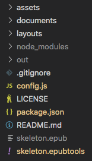
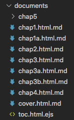
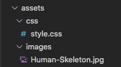
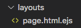

The `@akashacms/plugins-epub` plugin helps modify AkashaRender-rendered content to work well in an EPUB.  It is meant to be used along with _epubtools_ to generate an EPUB-formatted electronic book.  See https://akashacms.com/epubtools/toc.html for more information.

There are two aspects to `@akashacms/plugins-epub`:

1. Plugin for an AkashaCMS project
1. A standalone tool, `epubrender`, that renders Markdown or AsciiDoc documents into a directory structure compatible with EPUB requirements


# Installation

To add `@akashacms/plugins-epub` to a project directory, add the following to `package.json`

```
  "dependencies": {
    ...
    "@akashacms/plugins-epub": "^0.4.x",
    ...
  }
```

Once added to `package.json` run: `npm install`

# Using `epubrender` to generate EPUB directory structures

The `epubrender` command takes content from a cluster of directories, and produces an output directory that structured to match an EPUB.  It does not handle bundling the files into an EPUB.  That task left for other tools, with _epubtools_ being the intended tool.

The minimum requirement is a directory containing the documents from which the EPUB is built, along with a configuration file.  The configuration file describes the content to be rendered into the output directory.

An example project is available at: https://github.com/akashacms/epub-skeleton  We will use that project alongside this guide.

The project setup is meant to be like this:



The `documents` directory is the default name for where we put documents.



The `assets` directory is optional, and is the default name for _assets_ which are files that are simply copied into the rendered output.



The `layouts` directory is optional, and is the default name for where we put layout templates.  The single template used here is very simplistic.  We can use any kind of template supported by AkashaCMS, using any of the template template engines, and each document file can use a different layout template.



Another directory not shown here, `partials`, can be used, and can hold HTML snippets which can be included in the rendered EPUB.

The `out` directory is the default name for the rendered output directory.

The `config.js` file demonstrates using AkashaCMS directly to render EPUB content.  One uses this approach when the prepackaged experience of the `epubrender` command is not sufficient.

The `package.json` contains the project definitions, dependencies and scripts.  The scripts section includes `render`, to render the project to an EPUB directory, `bundle`, to convert the EPUB directory into a bundled EPUB, and `rebuild` to run both commands.

The `skeleton.epub` file is the packaged EPUB.

The `skeleton.epubtools` file is a YAML-formatted configuration file.  This file takes the place of `config.js` and is used with both `epubrender` and `epubtools`.  Both work from the same configuration file.

The directory names `documents`, `assets`, `layouts`, and `partials`, are defaults.  They can be overridden in the `.epubtools` configuration file using this section:

```yaml
akashaepub:
    bookroot: documents
    layoutsDir: layouts
    assetsDir: assets
    partialsDir: partials
    bookdest: out
```

If any of these items are missing, the software defaults to the values shown here.

The minimum required files are:

1. An `.epubtools` configuration file
1. A `package.json` listing `@akashacms/plugins-epub` as a dependency
1. A _bookroot_ directory (`documents`) containing Markdown or AsciiDoc or HTML files
1. One file in _bookroot_ must be the Table of Contents and satisfy the structure of an EPUB ToC.

# The EPUB Table of Contents

In the `epubrender`/`epubtools` configuration file, we declare which file is to have the Table of Contents for the EPUB:

```yaml
toc:
    href: toc.xhtml
    id: toc
```

In the Skeleton EPUB this file is generated from `toc.html.ejs` in the `documents` directory.  By declaring this file in the `.epubtools`, it will be referenced correctly in the OPF and NCX documents inside the EPUB.

EPUB reader software will scan this file for a Table of Contents.  The navigation element for a Table of Contents in EPUB must use this structure:

```html
<nav epub:type="toc" id="toc">
    <ol type="1" start="1">
        ...
    </ol>
</nav>
```

The `<nav>` element with `epub:type="toc"` is recognized in EPUB as providing the Table of Contents.  Within this element is to be an `<ol>` structure (ordered list) where the items are numbered starting from `1` as shown here.

Links to chapters etc are handled with normal `<li>` elements containing `<a>` tags.

The `<ol>`/`<li>` structure can be nested.  This is as is normally done in HTML.  In the skeleton EPUB we use this:

```html
<nav epub:type="toc" id="toc">
    <ol type="1" start="1">
    <li><a id="chap1" href="chap1.html"></a>
        <ol>
            <li><a id="chap1a" href="chap1a.html"></a></li>
        </ol>
    </li>
    <li><a id="chap2" href="chap2.html"></a></li>
    <li><a id="chap3" href="chap3.html"></a>
        <ol>
            <li><a id="chap3a" href="chap3a.html"></a></li>
            <li><a id="chap3b" href="chap3b.html"></a></li>
        </ol>
    </li>
    <li><a id="chap4" href="chap4.html"></a></li>
    <li><a id="chap5" href="chap5/chap5.html"></a>
        <ol>
            <li><a id="chap5a" href="chap5/chap5a.html"></a></li>
            <li><a id="chap5b" href="chap5/b/chap5b.html"></a></li>
        </ol>
    </li>
    </ol>
</nav>
```

EPUB reader software will extract this structure to use as the table of contents that is presented to the user.

## Alternative navigation support using NCX documents

Older EPUB v2 software used NCX documents for navigation.  These are XML files with specific structure.  They can be generated by `epubtools` if the `.epubtools` file has this declaration:

```yaml
ncx:
    id: "ncx"
    href: "toc.ncx"
```

# Configuring `@akashacms/plugins-epub` in AkashaCMS project

In `config.js` for the project:

```
config.use(require('@akashacms/plugins-epub'));
```

The plugin supplies AkashaCMS renderers and other things described later that customize AkashaCMS to produce output suitable for EPUB's.  For example all HTML files land with the `.xhtml` extension rather than `.html`.

It is also necessary to add this:

```js
config.setMahabhutaConfig({
    recognizeSelfClosing: true,
    recognizeCDATA: true,
    xmlMode: true
});
```

This configures Mahabhuta to configure Cheerio to produce XHTML output.

Unlike normal AkashaCMS use for the Web, an EPUB requires files in XHTML format with the file extension `.xhtml`.

# Partials

This plugin overrides the partial, `framed-embed.html.ejs`, from the `akashacms-embeddables` plugin.  This lets us reference an embedded thingy, like a YouTube video, but use it correctly in an EPUB.  By EPUB rules we cannot reference external resources like videos.  What we can do is use the data available to `framed-embed.html.ejs`, and embed only the HTML that is safe for use in an EPUB.

# Layouts

To assist building EPUB's, `@akashacms/plugins-epub` includes a small collection of layout templates.  Generally these templates support:

* The `title` variable used in both the `<head>` area and in an `<header><h1></h1></header>` construct
* A _teaser_ section at the top of the page, if the `teaser` variable is set
* The `content` variable included in the expected place inside `<body>`
* A _copyright_ message at the bottom of the page if the `copyrightPartial` variable is set.  As the variable name implies, this is the file name of a _partial_ containing stuff you want at the bottom of the page, such as a copyright message.

The three layout templates are:

* `ebook-page.html.ejs` -- Also incorporates stylesheets and JavaScript (EPUB3 does support JavaScript).  Meant for typical pages in an EPUB.
* `ebook-simple-page.html.ejs` -- Does not incorporate stylesheets of JavaScript.
* `ebook-toc-page.html.ejs` -- Like `ebook-page` but with a different file name, in case your needs include different layout templates for different pages.